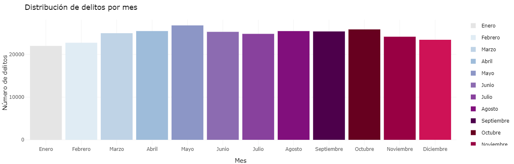
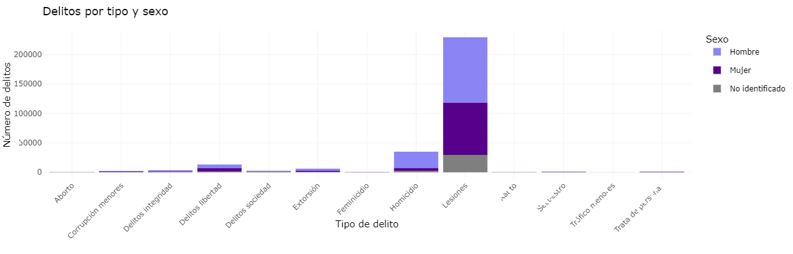

# Dashboard Interactivo para Análisis de Delitos en México

> 🚨 **Herramienta de análisis para la incidencia delictiva en México**  
> Este dashboard en R Shiny permite explorar datos de delitos por entidad, género, tipo y año de manera interactiva.

## 🎯 **Características**
- 📊 **Gráficos interactivos:** Análisis visual por mes, género y tipo de delito.
- 🗂️ **Tabla dinámica:** Exportación de datos filtrados en formatos como CSV o Excel.
- ⚙️ **Filtros personalizables:** Por entidad, tipo de delito, género y año.
- 🎨 **Visualizaciones mejoradas:** Colores personalizados y etiquetas legibles para gráficos.

---

## 🗂️ **Datos Utilizados**
> 📌 **Fuente:**  
> Cifras de Víctimas del Fuero Común (2015 - diciembre 2024), provenientes del [SESNSP](https://www.gob.mx/sesnsp/acciones-y-programas/datos-abiertos-de-incidencia-delictiva).

- **Cobertura temporal:** 2015 - diciembre 2024.  
- **Desglose:** Por entidad federativa, género, tipo de delito y año.

---

## 🛠️ **Tecnologías Utilizadas**
- **R y Shiny**: Desarrollo de la interfaz y lógica reactiva.
- **Plotly**: Gráficos interactivos y dinámicos.
- **DT**: Tablas de datos interactivas con opciones de exportación.
- **ggplot2**: Gráficos estáticos estilizados.

---

## 🚀 **Instrucciones de Uso**
1. Clona este repositorio en tu máquina local.
2. Instala las librerías necesarias en R.
3. Ejecuta la aplicación con `shiny::runApp()`.

> 💡 **Tip:** Puedes personalizar los filtros en la interfaz para explorar los datos de manera más precisa.

---

## 📈 **Visualizaciones Incluidas**
1. **Distribución mensual de delitos:** Gráfico de barras para identificar patrones por mes.  
2. **Delitos por género:** Comparación de delitos desglosados por sexo.  
3. **Delitos por tipo y género:** Gráfico de barras apiladas para analizar tendencias en tipos de delito.  
4. **Tabla interactiva:** Resumen detallado y exportable de los datos filtrados.

### Ejemplos de Visualizaciones
Aquí algunos ejemplos de cómo luce el dashboard:

1. **Distribución mensual de delitos**  
   

2. **Delitos por género**  
   

3. **Delitos por tipo y género**  
   

📬 **Contacto:**  
- **Correo:** [semiramis.gc18@gmail.com](mailto:semiramis.gc18@gmail.com)  
- **LinkedIn:** [Semiramis G. de la Cruz](https://www.linkedin.com/in/semiramis-g-de-la-cruz-56b3181b4/)  

